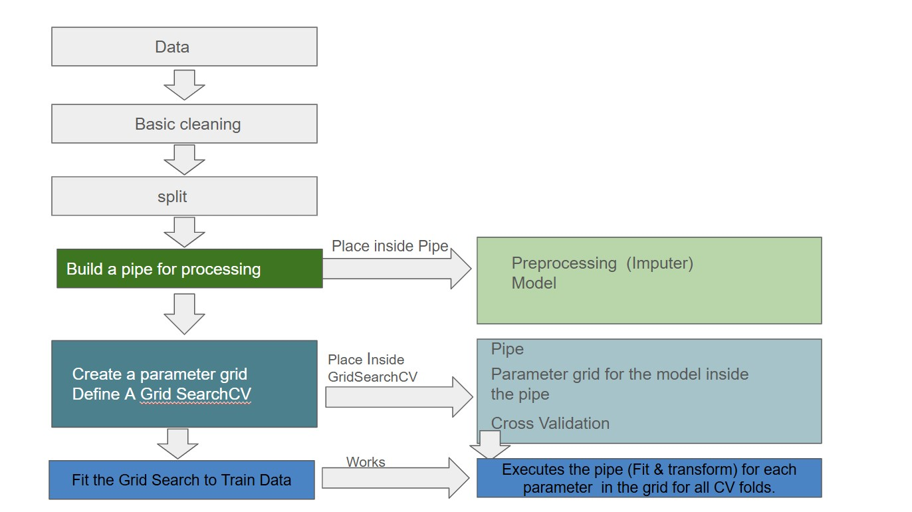
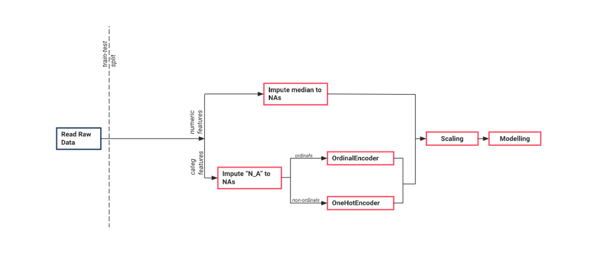

# Supervised_ML_Classification
Supervised ML_Classification - Predicting Housing Prices


In this project, we will create a model that predicts the price of a house based on its characteristics.
 overview of steps:
 


 
 
## Iteration 0: intuition-based model
Establishing a baseline model using simple, intuitive rules provides a reference point to evaluate the effectiveness of more complex machine learning models. By comparing the performance of these models against the baseline, one can assess their added value and ensure they offer significant improvements over straightforward approaches

## Iteration 1: train a decision tree
Training a Decision Tree
A decision tree is a model that predicts target variables by learning decision rules from data features.
### Scikit-Learn Pipelines
Scikit-Learn's Pipeline class streamlines machine learning workflows by chaining preprocessing and modeling steps, ensuring proper execution order and reproducibility.
### Cross-Validation
Cross-validation evaluates model performance by partitioning data into subsets for training and validation, helping assess generalization to unseen data and detect overfitting.
Integrating pipelines and cross-validation into decision tree training enhances model efficiency, reliability, and maintainability.


## Iteration 2: grid search
GridSearchCV automates hyperparameter tuning by exhaustively searching a predefined parameter grid and evaluating each combination using cross-validation to identify the optimal model configuration.
To define the parameter grid for cross validation, we need to create a dictionary, where:

- The keys are the name of the pipeline step, followed by two underscores and the name of the parameter we want to tune.
- The values are lists (or "ranges") with all the values we want to try for each parameter.

```
param_grid = {
    'decisiontreeclassifier__max_depth': range(2, 12),
    'decisiontreeclassifier__min_samples_leaf': range(3, 10, 2),
    'decisiontreeclassifier__min_samples_split': range(3, 40, 5),
    'decisiontreeclassifier__criterion':['gini', 'entropy']
    }
```
```
search = GridSearchCV(pipe, # you have defined this beforehand
                      param_grid, # your parameter grid
                      cv=5, # the value for K in K-fold Cross Validation
                      scoring='accuracy', # the performance metric to use,
                      verbose=1) # we want informative outputs during the training process, try changing it to 2 and see what happens
```
Check the docs: https://scikit-learn.org/stable/modules/generated/sklearn.model_selection.GridSearchCV.html


## Iteration 3: one-hot encoding
One-hot encoding transforms categorical variables into binary vectors, enabling machine learning algorithms to process non-numeric data effectively. Each category is represented by a vector with a single high (1) bit and all others low (0), ensuring no ordinal relationships are inferred between categories. While this method facilitates the inclusion of categorical data in models, it can increase dataset dimensionality, especially with features containing numerous unique categories. 

Cheack here the documentation for One Hot Encoder: https://scikit-learn.org/stable/modules/generated/sklearn.preprocessing.OneHotEncoder.html


## Iteration 4: ordinal encoding
Ordinal encoding takes all the classes in a categorical feature and assigns a number to them, starting at 0.
This will require you to create another branch within the categorical branch, so a new ColumnTransformer will be needed. The pipeline you aim for should look like this: 

Check here the documentation for the Ordinal encoder: https://scikit-learn.org/stable/modules/generated/sklearn.preprocessing.OrdinalEncoder.html


## Impute missing values: 
 ### Fit on train, transform train & test:
```
from sklearn.impute import SimpleImputer

my_imputer = SimpleImputer().set_output(transform='pandas')      # initialise
my_imputer.fit(X_num_train)                                      # fit on the train set
X_num_imputed_train = my_imputer.transform(X_num_train)          # transform the train set
X_num_imputed_test = my_imputer.transform(X_num_test)            # transform the test set
```


## Pipeline creation
Scikit-Learn Pipelines: They streamline data preparation and modeling into one step, but they will not increase the performance of  model.
```
from sklearn.pipeline import make_pipeline
pipe = make_pipeline(imputer, dtree).set_output(transform='pandas')
```


### Explore the best parameters and the best score achieved with your cross validation:

```
search.best_params_
search.best_score_
```

## Categorical encoding - "Automated" approach (Using Pipelines)

In the manual approach, to encode the categorical columns numerically, we have:

1. Selected the categorical columns.
2. Fitted a `OneHotEncoder` to them.
3. Transformed the categorical columns with the encoder.
4. Converted the sparse matrix into a dataframe.
5. Recovered the names of the columns.
6. Concatenated the one-hot columns with the numerical columns.

All these steps can be synthetised by using Scikit-Learn Pipelines and specifically something called `ColumnTransformer`, which allows us to apply different transformations to two or more groups of columns: in our case, categorical and numerical columns.

This process is also called creating "branches" in the pipeline. One branch for the categorical columns and another for the numerical columns. Each branch will contain as many transformers as we want. Then, the branches will meet again, and the transformed columns will be automatically concatenated.
